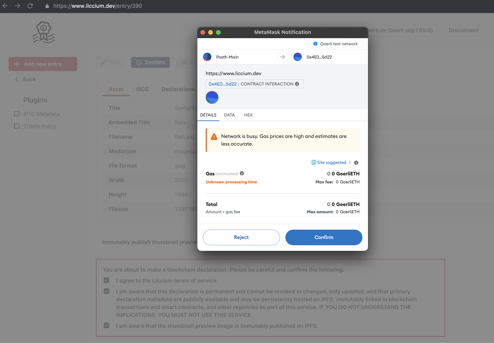

# Content declarations

With the first public version of the Liccium app, the service is supporting the declaration of ISCC codes on test and main networks of Ethererum and Polygon.&#x20;

<figure><figcaption></figcaption></figure>
