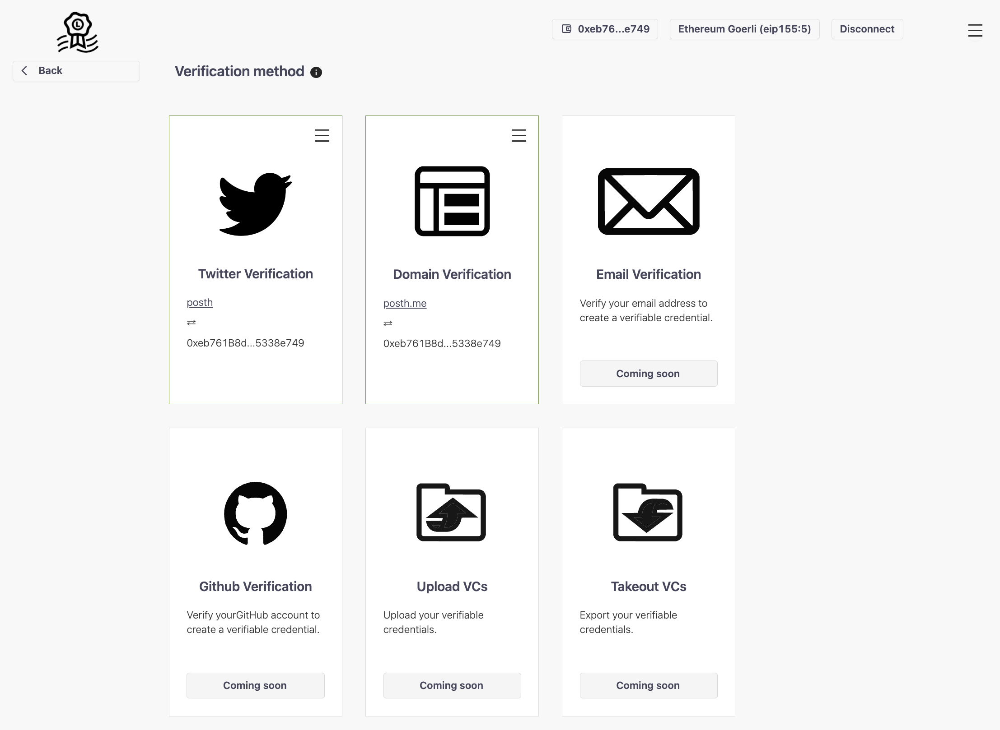

# Creator credentials

Liccium uses [creator credentials](https://docs.liccium.com/whitepaper/verifiable-credentials/creator-credentials-vcs) to create trust in otherwise permissionless content declarations, claims and attribution. The app supports the creation and issuance of verifiable credentials (VCs) to the users (holders).

By going through a short process of **social** and/or **domain verification,** verifiable credentials (VCs) will be issued by the Liccium app to the users. These VCs are inseparably linked from the declaration metadata and can be verified decentrally by anyone.

<figure><figcaption></figcaption></figure>

Learn more how Liccium makes use of verifiable credentials and how VCs can be used to create trust and transparency in the media sectors from the Liccium whitepaper: [https://docs.liccium.com/whitepaper/verifiable-credentials/creator-credentials-vcs](https://docs.liccium.com/whitepaper/verifiable-credentials/creator-credentials-vcs).


In 2023, the European Union funded a project called 'Creator Credentials' as one selected project of the NGI's Trustchain consortium under grant agreement Nr. 101093274.&#x20;

The Creator Credentials project will develop a user-centric digital identity management framework specifically designed for the cultural and creative communities. This includes a software application that can be used by media organisations to issue verifiable credentials to creators and other rightsholders. Creator Credentials will increase the trustworthiness of declarations and claims to digital media content online.

[https://trustchain.ngi.eu/creatorcredentials](https://trustchain.ngi.eu/creatorcredentials)

