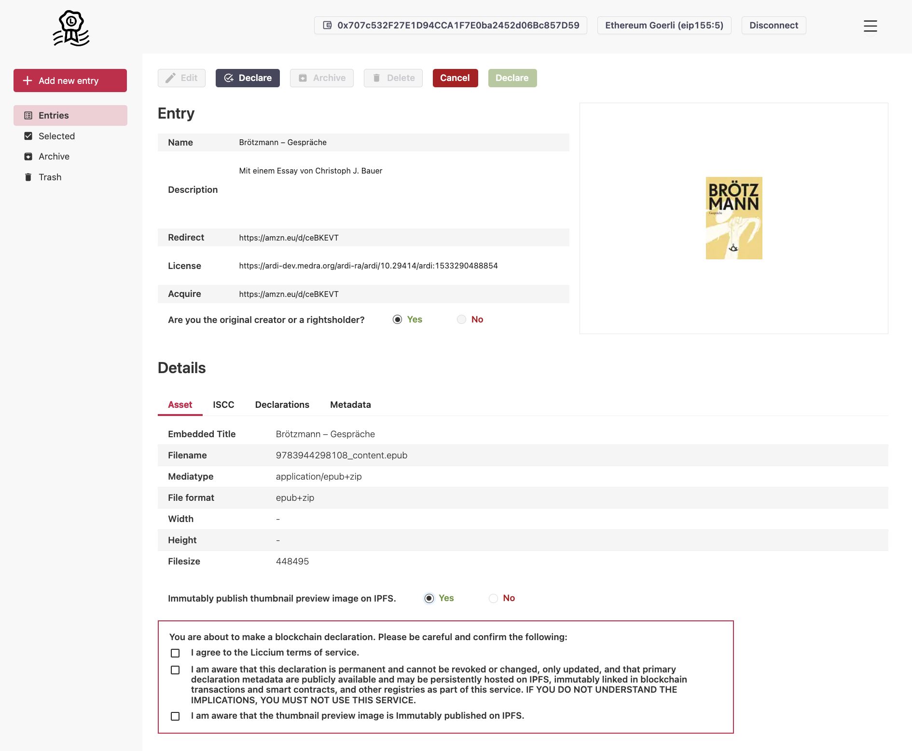

# Declaring content

Liccium allows the declaration of ISCC codes on public blockchain networks. Currently, the `Ethereum Goerli testnet` is supported.&#x20;

<figure><figcaption></figcaption></figure>
