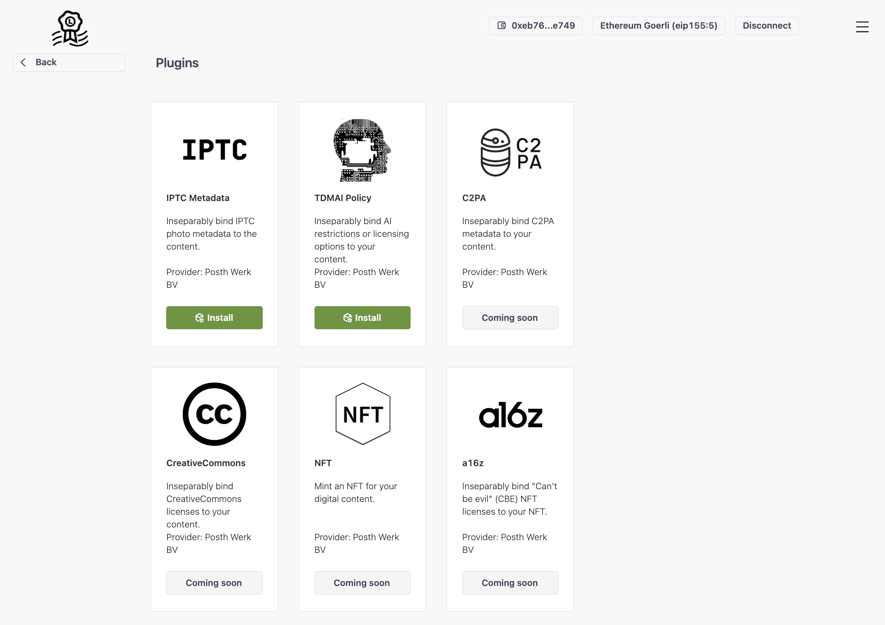
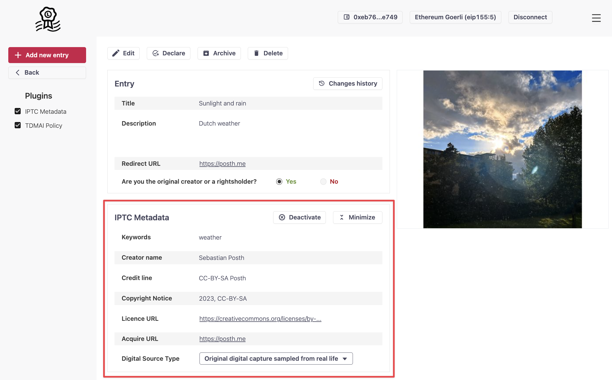

# Liccium plugins

Liccium plugins enable the integration of use-case- or industry-specific metadata to declarations. These plugins enhance the app's generic functionality for creators and rightsholders. With Liccium they can seamlessly embed metadata and bind external metadata to their content, thereby customising the app to their specific needs.

<figure><figcaption>
Liccium plugins
</figcaption></figure>

## IPTC photo metadata

Photographers and photojournalists currently use the IPTC standards to attach technical, descriptive, and administrative metadata or copyright information to their images. With Liccium, they can inseparably bind IPTC photo metadata to their content even if the content has been altered or manipulated, or metadata have been stripped from the content.

<figure><figcaption></figcaption></figure>

## TDM·AI policy

A protocol to facilitate machine-readable opt-out declarations for Text and Data Mining (TDM) for AI providers based on the DSM Directive on Copyright 2019/790, Article 4, leveraging the benefits of the International Standard Content Code ([ISCC](https://iscc.codes)) and [Creator Credentials](https://docs.creatorcredentials.com/).

<figure><figcaption>
TDM·AI policy
</figcaption></figure>

<figure><figcaption>
Machine-readable opt-out declaration (Art. 4 CDSM)
</figcaption></figure>
