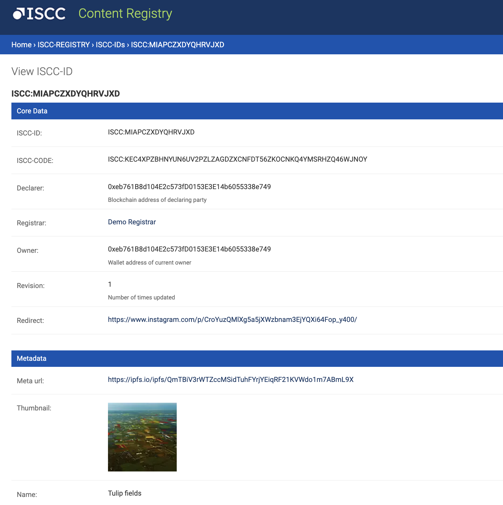

# Terms of service

The MVP of the Liccium app is **for testing purposes only and pre-alpha**! By using the MVP of the Liccium app you accept the following preliminary terms of service.

## ISCC Codes

* With the Liccium app, the user can generate ISCC codes using the latest version of the upcoming ISO standard.
* You are aware that ISCC is not yet a published ISO standard. However, it is likely that the current version of the ISCC will not undergo major updates before the final publication of the ISO standard, which means that the codes generated are likely to remain stable.

## Granted rights and licences

* The Liccium app is operated by [Posth Werk BV](https://liccium.com/imprint) and ISCC codes are created by uploading digital media files to servers controlled by the same company. For testing purposes, the digital media files will be retained on the servers after the ISCC codes are generated. However, they will be deleted after six months without further notice, but they can be removed at any time upon request.&#x20;
* Posth Werk BV will use user data and content only as necessary to provide the Liccium MVP service and for no other purpose. Posth Werk BV may share user data and content with third-party service providers as necessary to provide the Liccium app service, such as hosting and storage providers. Any third-party service providers will be required to protect user data and content in accordance with this policy.&#x20;
* Users may terminate the use of the Liccium app at any time by contacting Posth Werk BV. Upon termination, your data will be deleted from our servers.&#x20;
* The Liccium MVP is in a non-public alpha stage of development and is provided **for testing purposes only**. The MVP may contain bugs, errors or other issues that may affect its performance or functionality. Use of the MVP is at your own risk and Posth Werk BV is not responsible for any damages or losses resulting from your use of the app.&#x20;
* Users are aware that all data can be deleted at any time due to product updates or if required by law.

## Responsibilities

* The user agrees to use the Liccium app only for lawful purposes and in compliance with all applicable laws and regulations.&#x20;
* **The user is aware of the fact that declarations on the Goerli testnet made with the Liccium app are permanent and cannot be revoked or changed.**
* The user of the Liccium app is aware of the fact that primary declaration metadata are publicly available and may be persistently hosted on IPFS, immutably linked in blockchain transactions and smart contracts on the `Ethererum Goerli testnet` and listed in ISCC testnet-registries as part of this service.&#x20;
* The user of the Liccium app is aware of the fact that **thumbnails generated from the digital media files** (not the uploaded digital media assets themselves) **will be uploaded and may be permanently stored on IPFS**! The thumbnails have a physical resolution of 128 pixels for the larger side of the image.&#x20;

<figure><figcaption></figcaption></figure>

## Privacy

* Posth Werk BV is committed to GDPR compliance and will process your personal data in accordance with the GDPR. We have implemented appropriate technical and organisational measures to protect your personal data and will only process it for the purpose of providing the Liccium app service. You have the right to access, correct, and delete your personal data at any time. See also: [https://liccium.com/privacy-policy/](https://liccium.com/privacy-policy/)

## Copyrights of content for testing purposes

* Even if the Liccium app does not publish the actual content (only thumbnails of the media assets), for **testing purposes** users are asked to use content that is either available under a CC0 licence or properly licensed, where rights are properly documented, or where users hold the rights as the creator or rightsholder.
* Users should not use any content for persistent timestamping unless they intend it to be permanently timestamped.

## Contact

If you have any questions or would like to receive a personal demonstration, please feel free to reach out:

Sebastian Posth \
Phone: +31 6onetwo6sven67two6 (Phone, Signal, Telegram, WhatsApp) \
E-mail: werk@posth.me
